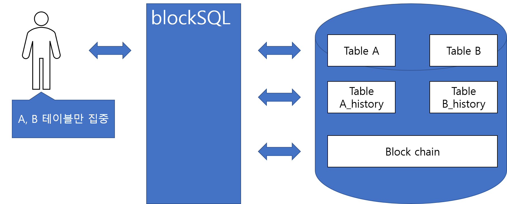
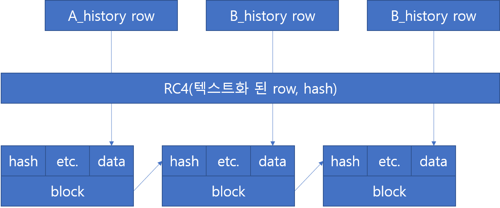

blockSQL
======
# index
1. [summary](#1summary)

2. [install](#2install)

3. [how to use](#3how-to-use)

    3.1. [import](#3.1import)

    3.2. [connect database](#3.2connect-database)

    3.3. [run sql](#3.3run-sql)

    3.4. [history and block table](#3.4.history-and-block-table)

    3.5. [check modulation](#3.5check-modulation)

4. [example](#4예제)

    4.1. [school](#4.1school)

# [1.](#index)summary

 하나의 데이터베이스안 모든 테이블의 모든 연산에 대해, 각각의 테이블에 대한 history와 그 모든 history에 대한 블록체인을 관리하는 패키지입니다.

 위 그림에서 사용자는 A,B 테이블을 만들고 sql명령어로 A,B 테이블 연산을 하면 blockSQL이 자동으로 A_history와 B_history 그리고 block chain 테이블을 관리합니다.

 

A_history 테이블은 history id와 추가로 A 테이블의 컬럼을 그대로 가지고 있어, 빠르게 특정 기록을 검색할 수 있습니다.

그리고 block table은 block chain 구조이고, history의 내용과 이전 블록의 row를 해시한 결과를 가집니다. 각각 사용자가 만든 모든 테이블에 대한 각각의 history는 컬럼이 다르기 때문에 텍스트화 해서 저장합니다. 또 저장을 RC4 알고리즘으로 해당 블록의 해시값을 키로 사용해서 암호화 해서 저장합니다.

# [2.](#index)install

[blockSQL.zip](https://github.com/hslee1539/blockSQL/archive/master.zip)

또는

`git clone https://github.com/hslee1539/blockSQL.git`

등등, 작업중인 폴더에 blockSQL 폴더가 있으면 됩니다.

# [3.](#index)how to use
전체적으로 파이썬의 sqlite3처럼 사용하면 됩니다.
## [3.1.](#3.how-to-use)import
~~~python
import blockSQL
~~~
으로 패키지를 import 합니다. 또는
~~~python
from blockSQL import Connection, Cursor
~~~
등등 방법으로 import 합니다.

## [3.2.](#3.how-to-use)connect database
~~~python
import blockSQL
connection = blockSQL.Connection("-your databass file-")
~~~
blockSQL.[Connection](./connection_module.py) 클래스를 생성하면 됩니다.
sqlite와 다르게 클래스를 직접 생성자로 생성하는 방법만 지원합니다.
## [3.3.](#3.how-to-use)run sql
~~~python
import blockSQL
connection = blockSQL.Connection("-your databass file-")
cursor = connection.execute("-your sql-")
cursor.execute("-your sql 2-")
~~~
>참고!! sql 예약어들을 대문자로 입력을 해야 blockSQL이  실행됩니다. 소문자를 입력시 일반 sqlite가 작동됩니다.

## [3.4.](#3.how-to-use)history-and-block-table
~~~python
import blockSQL
connection = blockSQL.Connection(":memory:") # block 테이블이 만들어 지는 시점
connection.execute("""
CREATE TABLE a (
    col1 INTEGER PRIMARY KEY,
    col2 TEXT
)""")# a_history가 만들어지는 시점
connection.execute("""
INSERT INTO a
VALUES ( 10, "ten")
""")# a_history와 block 테이블에도 insert됨
retval = connection.cursor().execute("""
SELECT *
FROM block""").fetchall() # block 테이블 조회
~~~
또 아래의 코드처럼 권장하지는 않지만, 일반 sqlite 쿼리로 기록을 남기지 않고 사용할 수 있습니다.
~~~python
import blockSQL
connection = blockSQL.Connection(":memory:") # block 테이블이 만들어 지는 시점
connection.execute("""
CREATE TABLE a (
    col1 INTEGER PRIMARY KEY,
    col2 TEXT
)""")# a_history가 만들어지는 시점
connection.execute("""
insert into a
values ( 10, "ten")
""")# a_history와 block 테이블에는 기록되지 않음
retval = connection.cursor().execute("""
SELECT *
FROM block""").fetchall() # block 테이블 조회
~~~

아래의 코드는 테이블 생성을 일반 sqlite 쿼리를 했을 때, 그 테이블을 blockSQL로 insert할때 에러가 발생합니다.
~~~python
import blockSQL
connection = blockSQL.Connection(":memory:") # block 테이블이 만들어 지는 시점
connection.execute("""
create table a (
    col1 INTEGER PRIMARY KEY,
    col2 TEXT
)""")# a_history를 만들지 않음
connection.execute("""
INSERT INTO a
VALUES ( 10, "ten")
""")# sqlite3 에러 : a_history 테이블이 없음
~~~
## [3.5.](#3.how-to-use)check-modulation
blockSQL의 위변조 유무를 Connection.checkFast 메소드로 확인할 수 있습니다.

# [4.](#index)example
## [4.1.](#3.example)school
[school_module.py](./example/school_module.py)

